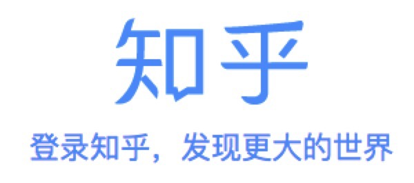
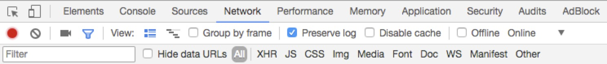
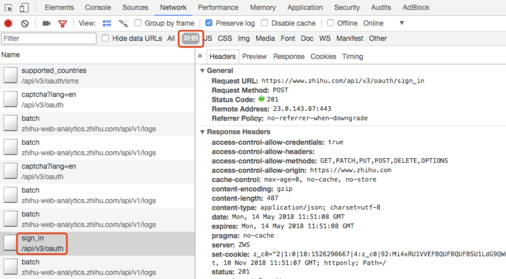
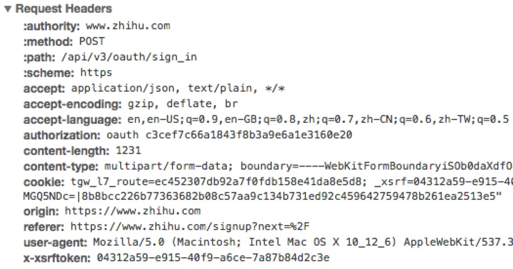
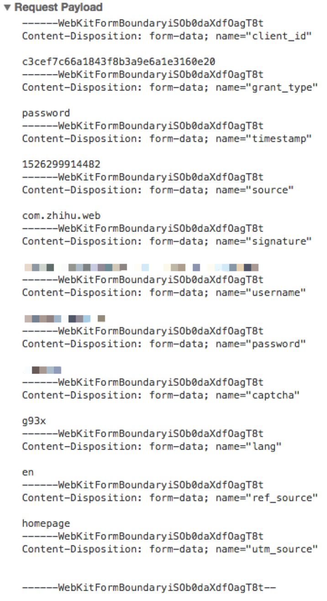
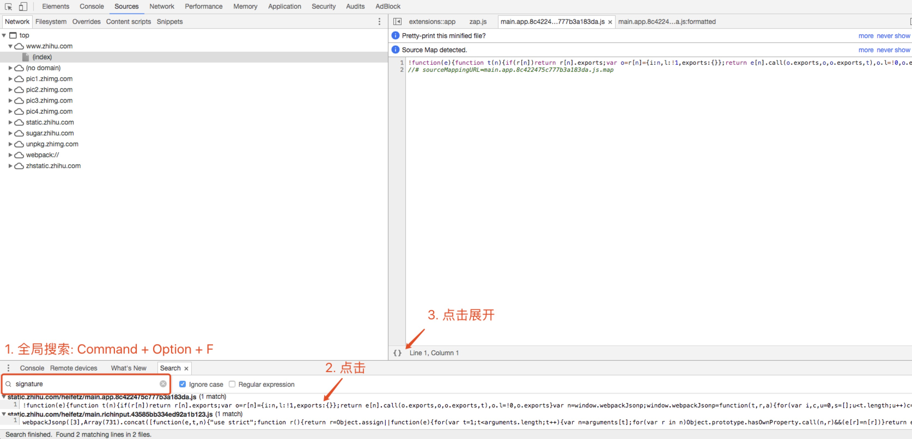
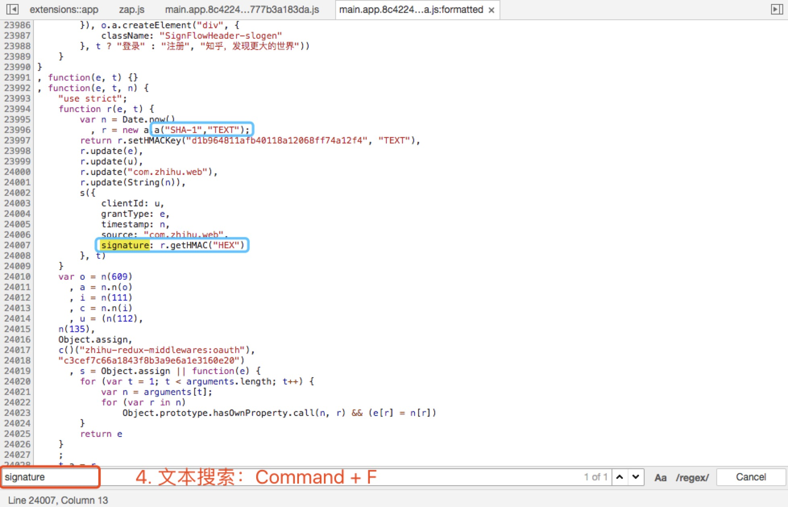
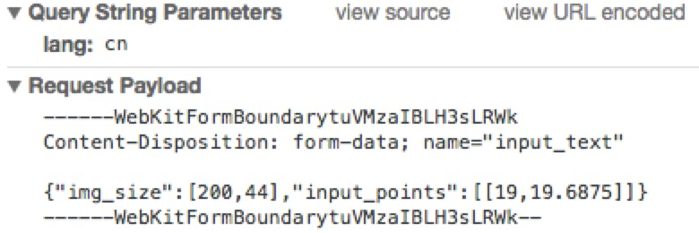
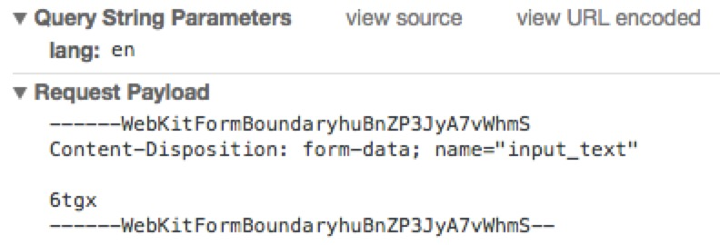

<div align="center">
    
</div>

# Python 知乎登录脚本

## 说明

> 项目来源 [Zhihu-Login](https://github.com/zkqiang/Zhihu-Login)
> 根据原作者的说明，学习理解并整理登录请求的解析思路


## 运行环境

**要求**<br/>

- python=2.7.14
 - requests==2.18.4 [网页请求]
 - Pillow==5.1.0 [读取验证码]
 - matplotlib==2.2.2 [处理验证码]

**安装**<br/>

```shell
pip install -r requirements.txt 
```

## 调用说明

**运行**<br/>

```shell
python zhihu.py [--name session_name] [--cookiefile cookies_path] [--debug]
```

**参数**<br/>
`--name`: 会话名称，用于日志记录<br/>
`--cookiefile`: Cookies文件，用于储存和读取<br/>
`--debug`: 调用Debug模式

<br/>
<br/>
<br/>

# 解析思路

## 工具

Chrome - Developer Tools [Command + Option + I]<br/>

<div align="center">
    
</div>

> 勾选 "Preserve log" 防止跳转丢失信息


## 模拟登陆

<div align="center">
    
</div>

> 勾选 "XHR (XMLHttpRequest)" 查看请求相关的信息
> 模拟登陆一次，选择 "sign_in" 的文件进行查看

在 Headers 的信息中可以得到
请求网页 `https://www.zhihu.com/api/v3/oauth/sign_in`
请求方式 `POST`


### Headers

<div align="center">
    
</div>

在 Headers -> Request Header 的项目里可以看到 `POST` 需要提供的 `headers`
通过测试发现 `authorization` 和 `X-Xsrftoken` 这两个是必需的
- `authorization` 是一个固定值
- `x-xsrftoken` 是防 Xsrf 跨站的 Token 认证，通过查找发现该字段在第一次请求网页后，会通过 `set-cookie` 的方式通过 `_xsrf` 字段储存在 `cookies` 中


### Payload

<div align="center">
    
</div>

在 Headers -> Request Header 的项目里可以看到 `POST` 需要提供的 `payload`
- `client_id` 固定字段
- `grant_type` 固定字段
- `timestamp` 时间戳，这里是13位整数，毫秒级别，Python 生成的整数部分只有10位，需要再乘上1000
- `source` 固定字段
- `signature` 比较复杂，后面详述
- `username` 账号，明文（手机号前面加 `+86` ）
- `password` 密码，明文
- `captcha` 验证码，根据是否需要键入而定，没有就为空，后面详述
- `lang` 系统语言，也决定验证码的输入方式
- `ref_source` 固定字段


### Signature

<div align="center">
    
</div>
<br/>
<div align="center">
    
</div>

通过全局搜索在 js 文件中找到与 signature 相关的代码，可以看出是通过 HMAC 算法，利用加入特定字段生成的

```python
import hmac
import hashlib

def build_signature(timestamp):
    """Build Signature
    [Info]
        利用 Hmac 算法计算返回签名
    [Argument]
        timestamp: 时间戳，毫秒，字符串
    [Return]
        signature: 签名
    """
    grant_type = 'password'
    client_id = 'c3cef7c66a1843f8b3a9e6a1e3160e20'
    source = 'com.zhihu.web'

    key = 'd1b964811afb40118a12068ff74a12f4'
    msg = grant_type + client_id + source + timestamp

    signature = hmac.new(key=key, msg=msg, digestmod=hashlib.sha1).hexdigest()

    return signature
```


### 验证码

在 Network 中勾选 XHR 可以看到除了 sign_in 以外，captcha 也是一个单独调用的接口，无论是否需要输入都会调用一次

调用接口 
- `https://www.zhihu.com/api/v3/oauth/captcha?lang=en`
- `https://www.zhihu.com/api/v3/oauth/captcha?lang=cn`

调用方式 
- `GET` 返回是否需要验证码
- `PUT` 获取验证码，返回 base64 编码的图片
- `POST` 提交验证码，返回验证结果

如果 `GET` 返回结果是 `show_captcha==true`

就需要进一步获取验证码，通过 `PUT` 请求得到字段为 `img_base64` 的 base64 编码的图片
```python
import io
import base64

from PIL import Image

img = Image.open(io.BytesIO(base64.b64decode(resp['img_base64'])))
```

利用 `matplotlib` 显示图片，并输入返回结果，通过 `POST` 请求提交验证
通过 payload 可以查看返回的格式

中文
<div align="center">
    
</div>

英文
<div align="center">
    
</div>

